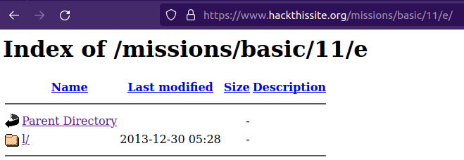
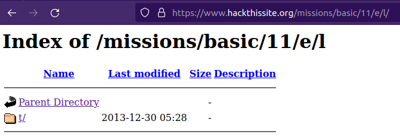
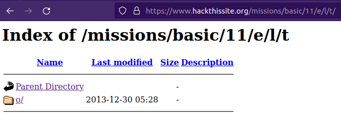
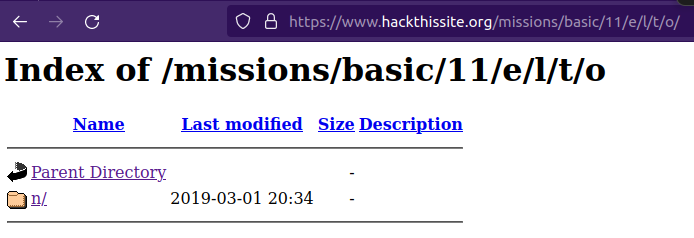
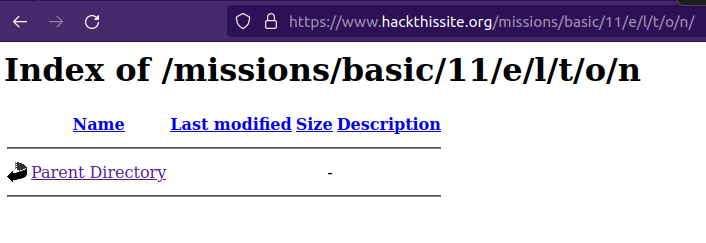

# Basic 11

## Challenge Text

> Sam decided to make a music site. Unfortunately he does not understand Apache. This mission is a bit harder than the other basics.

## Writeup

For this challenge we're given very little information to go on. As soon as we click on the challenge we're taken to https://www.hackthissite.org/missions/basic/11/ where we'll see a randomly generated song title. Some examples are:

> I love my music! "Candle in the Wind" is the best!

> I love my music! "I Cry at Night" is the best!

> I love my music! "Ballad of a Well-Known Gun" is the best!

> I love my music! "Weight of the World " is the best!

> I love my music! "Wouldn't Have You Any Other Way" is the best!

> I love my music! "Just Like Strange Rain" is the best!

> I love my music! "Sorry Seems to Be the Hardest Word" is the best!

After refreshing the page many times you'll see that all these songs are by Elton John.

But visiting ```https://www.hackthissite.org/missions/basic/11/elton```, ```https://www.hackthissite.org/missions/basic/11/music```, or ```https://www.hackthissite.org/missions/basic/11/songs``` all lead nowhere.

So it seems for the first time in this series of challenges we'll need to [fuzz](https://owasp.org/www-community/Fuzzing "OWASP Article On Fuzzing") the challenge URL.

To fuzz the URL we can use [ffuf](https://www.freecodecamp.org/news/how-to-fuzz-hidden-directories-files-with-ffuf/ "freeCodeCamp Article On How To Use FFUF") and pretty much any [wordlist](https://www.hackingarticles.in/wordlists-for-pentester/ "Article On What Wordlists Are"). The wordlist I chose is [directory-list-2.3-small.txt](https://github.com/danielmiessler/SecLists/blob/master/Discovery/Web-Content/directory-list-2.3-small.txt "Small Directory Word List").

The syntax for our ffuf command is ```ffuf -c -w /path/to/wordlist/ -u https://www.hackthissite.org/missions/basic/11/FUZZ -mc 200,301 -s```.

This will silently run and only print results with status codes 200 or 301.

After running the scan we should see output similar to the following.

```
$ ffuf -c -w /path/to/wordlist/ -u https://www.hackthissite.org/missions/basic/11/FUZZ -mc 200,301 -s

e
```

We find a single directory named ```e```. After navigating to https://www.hackthissite.org/missions/basic/11/e we'll see an unprotected directory containing another directory simply named ```l```.



If we keep moving into the newfound directories we'll eventually end up at https://www.hackthissite.org/missions/basic/11/e/l/t/o/n/.









Again we'll find ourselves needing to fuzz this directory in order to figure out our next move. This time we'll use an [Apache Server wordlist](https://github.com/danielmiessler/SecLists/blob/master/Discovery/Web-Content/apache.txt "Apache Server Wordlist") that contains files commonly found on Apache servers.

The ```ffuf``` command will be similar to the one we ran before except now we're running it on https://www.hackthissite.org/missions/basic/11/e/l/t/o/n/.

```
$ ffuf -c -w /path/to/wordlist -u https://www.hackthissite.org/missions/basic/11/e/l/t/o/n/FUZZ -mc 200,301 -s

.htaccess
```

After running the scan we'll find an [.htaccess](https://www.lifewire.com/htaccess-file-2621687 "Article About What A htaccess File Is") file and if we access it by navigating to https://www.hackthissite.org/missions/basic/11/e/l/t/o/n/.htaccess we'll see the following entry implying the existence of a directory named ```DaAnswer```.

```
IndexIgnore DaAnswer.* .htaccess
<Files .htaccess>
require all granted
</Files>
```

Navigating to https://www.hackthissite.org/missions/basic/11/e/l/t/o/n/DaAnswer we'll see the following text.

> The answer is around! Just look a little harder.

And this is where the challenge gets incredibly frustrating because the answer is literally just the word ```around``` which you can enter at https://www.hackthissite.org/missions/basic/11/index.php to finish the challenge.