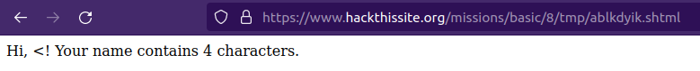
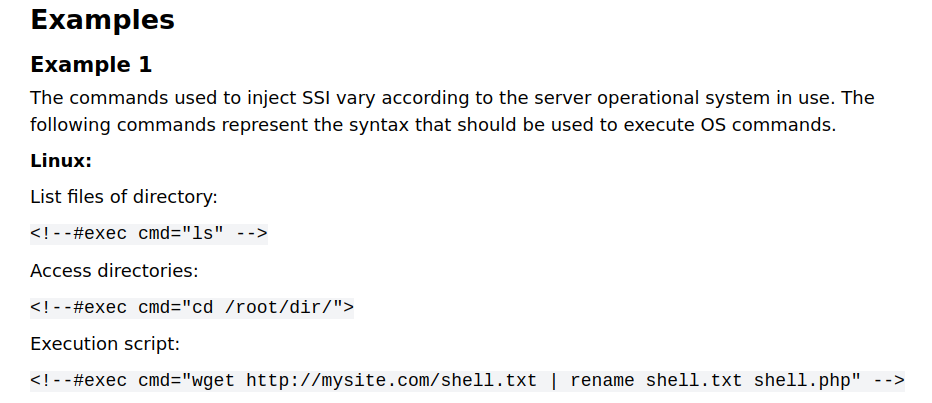

# Basic 8

## Challenge Text

> The password is yet again hidden in an unknown file. Sam's daughter has begun learning PHP, and has a small script to demonstrate her knowledge. Requirements: Knowledge of SSI (dynamic html executed by the server, rather than the browser)

> Sam remains confident that an obscured password file is still the best idea, but he screwed up with the calendar program. Sam has saved the unencrypted password file in /var/www/hackthissite.org/html/missions/basic/8/

> However, Sam's young daughter Stephanie has just learned to program in PHP. She's talented for her age, but she knows nothing about security. She recently learned about saving files, and she wrote a script to demonstrate her ability.

## Writeup

If we read the challenge text we'll see that this levels requirements include knowledge of ```SSI``` (server side includes) and if we search online for Server Side Include vulnerabilities we'll see a ton of articles referring to an attack known as Server Side Includes Injection. Reading the [OWASP article on SSI Injections](https://owasp.org/www-community/attacks/Server-Side_Includes_(SSI)_Injection "OWASP") we'll learn that SSI's are directives used to generate dynamic HTML by the server.

If data provided through the web application is not properly validated the application will be vulnerable to injection, where a user can execute their own SSI directives.

One way to check if a site is vulnerable to an SSI injection is to insert special characters that are used in SSI directives to see how they're handled. Special characters include the following.

```< ! # = / . " - > and [a-zA-Z0-9]```

Another way to look for potential SSI Injection vulnerabilities is to look for pages with the following extensions.

* ```.stm```
* ```.shtm```
* ```.shtml```

We can verify both these things by providing a single ```<``` as input. Where we'll see that the program not only accepts the symbol but it incorrectly calculates it's length at **4** characters. We'll also see that the file extension is ```.shtml```.



Now that we know the program is vulnerable we can use the same [OWASP article on SSI Injections](https://owasp.org/www-community/attacks/Server-Side_Includes_(SSI)_Injection "OWASP") from earlier to look for syntax examples for this attack.



We can start by listing the contents of the current directory by using the following command.

```<!--#exec cmd="ls"-->```

The output of the above command:

```
Hi, tshngmww.shtml hipykpqu.shtml ztxdhjxn.shtml avpfeoie.shtml fviqpmaw.shtml kqbybdzc.shtml dzrnmzgx.shtml npcsygfl.shtml whqxxojt.shtml ylomcmvu.shtml uhdppswp.shtml gzntiicx.shtml dzwbqiuu.shtml qvzuieng.shtml smcerykh.shtml qjhnmhmq.shtml znodwztr.shtml! Your name contains 254 characters.
```

The exploit works but we were told the password file can be found at ```/var/www/hackthissite.org/html/missions/basic/8/``` and we're currently listing the contents of ```https://www.hackthissite.org/missions/basic/8/tmp/mumewoit.shtml```. So we'll need to edit the command to list the contents of the parent directory.

New Command - ```<!--#exec cmd="ls ../"-->```

The output from the above command will show us the contents of ```https://www.hackthissite.org/missions/basic/8/``` where we'll find the obscurely named password file.

```
Hi, au12ha39vc.php index.php level8.php tmp! Your name contains 39 characters.
```

Now all we have to do is read the password by visiting this file at ```https://www.hackthissite.org/missions/basic/8/au12ha39vc.php``` where we'll see the following.

```e06a9c6f```