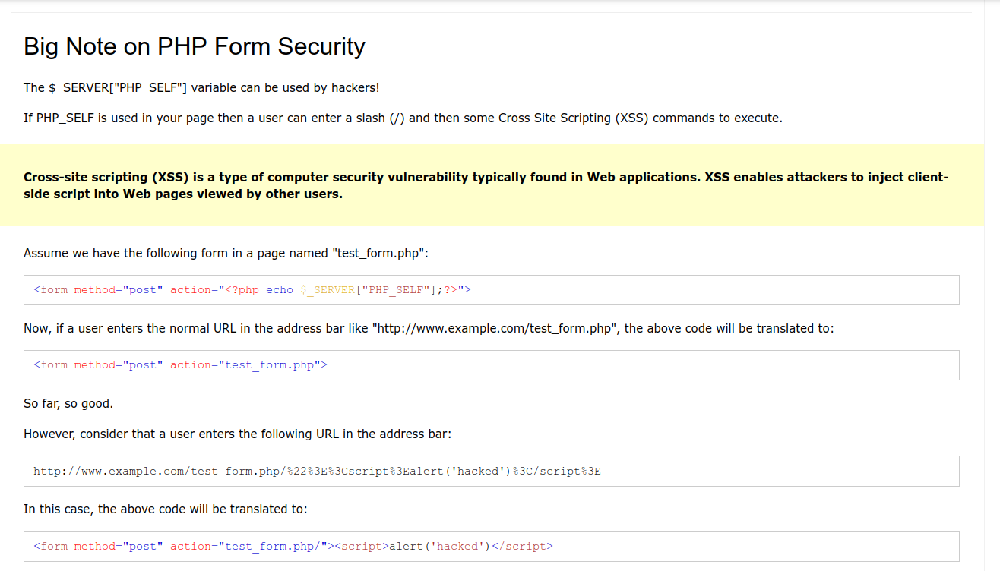
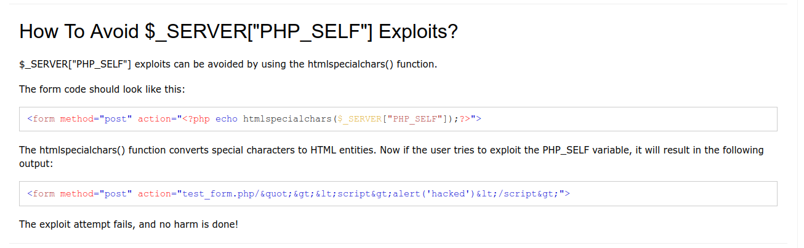

# Bugs? In my PHP? It's More Likely Than You Think

## Challenge Text

> Fix this script.

> There is only one line that has a vuln, correct it. The output does not have to be valid XHTML and assume that a mysql connection has been made already.

> There is a bug as well as a vuln. You MUST fix both.

> Here is the script:

```php
<?php
        if (!empty($_POST['data']))
        {
                $data = mysql_real_escape_string($_POST['data']);
                mysql_query("INSERT INTO tbl_data (data) VALUES ('$data')");
        }
?>
<form name="grezvahfvfnjuvavatovgpu" action="<?=$_SERVER['PHP_SELF']?>" method="get">
        <input type="text" name="data" />
        <input type="submit" />
</form>
```

> Dev note

> We're sick of getting bug reports saying <?= ... ?> isn't valid php syntax. If you don't believe us, [consult the first page of the php.net language reference](https://www.php.net/manual/en/language.basic-syntax.php "PHP Documentation For Basic Syntax").

## Writeup

For this challenge, we're given the source code to a PHP script and asked to fix it. We're told there is one bug and one vulnerabilty. It's never specifically stated that the vulnerability and the bug are on the same line but it's safe to assume so, due to the way the answers are turned in. Usually in these challenges we have to turn in a single line of code. That being said, finding the bug first will make it easier to find the vulnerability, or vice versa.

Starting off we can break the program into two logical parts. The first piece, written in PHP is used for Form Handling. The second piece, written in HTML is used for Form Display.

**First Piece Of Program Used For Handling Form Data:**

```php
<?php
        if (!empty($_POST['data']))
        {
                $data = mysql_real_escape_string($_POST['data']);
                mysql_query("INSERT INTO tbl_data (data) VALUES ('$data')");
        }
?>
```

**Second Piece Of Program Used For Displaying Form:**

```html
<form name="grezvahfvfnjuvavatovgpu" action="<?=$_SERVER['PHP_SELF']?>" method="get">
        <input type="text" name="data" />
        <input type="submit" />
</form>
```

Now we can do a deeper dive into each section, by analyzing the code line by line to find the bug and vulnerability. Starting with the the PHP code responsible for handling the data coming in from the form.

The PHP code starts with a conditional statement that checks wether the ```data``` parameter's value provided through the ```POST``` request method is not empty. If it is empty, nothing is done and the PHP program ends without ever doing anything.

```php
if (!empty($_POST['data']))
```

If the value provided through the POST request methods ```data``` parameter is not empty, the value is taken and passed to the [mysql_real_escape_string](https://www.php.net/mysql_real_escape_string "PHP Documentation For mysql_real_escape_string") function and the result is stored in the ```$data``` variable. The [mysql_real_escape_string](https://www.php.net/mysql_real_escape_string "PHP Documentation For mysql_real_escape_string") function is used for escaping special characters that may have been passed in through the data and is used to prevent SQL injection attacks (this function is now deprecated, but this challenge is very old so this is not the vulnerability we're looking for).

```php
$data = mysql_real_escape_string($_POST['data']);
```

The last line in the PHP code uses the [mysql_query](https://www.php.net/mysql_query "PHP Documentation For mysql_query Function") function to ```INSERT``` the value from the ```$data``` variable into a table named ```tbl_data```. Even though the [mysql_query](https://www.php.net/mysql_query "PHP Documentation For mysql_query Function") function is deprecated this isn't the vulnerability we're looking for.

```php
mysql_query("INSERT INTO tbl_data (data) VALUES ('$data')");
```

After reviewing the PHP code, we won't find any vulnerabilities (relating to this challenge), just a simple program that takes data from a ```POST``` request and stores it in a database. That only leaves the second section of the program to break down.

In the second part of the program a form is created, by using the HTML ```<form>``` element.

```html
<form name="grezvahfvfnjuvavatovgpu" action="<?=$_SERVER['PHP_SELF']?>" method="get">
```

Within the ```<form>``` opening tag the ```name``` attribute is set to ```grezvahfvfnjuvavatovgpu```, this name is never used or referenced in the PHP script, it exists only as an easter egg that I'll explain at the end.

```name="grezvahfvfnjuvavatovgpu"```

The ```action``` attributes value is set to ```<?=$_SERVER['PHP_SELF']?>``` which is PHP shorthand syntax for ```<?php echo $_SERVER['PHP_SELF']; ?>```. The [$_SERVER](https://www.w3schools.com/Php/php_superglobals_server.asp "W3 Schools Article On $_SERVER Super Global") variable is a PHP super global that contains information about headers, paths and script locations. In this case it is being used to access the name of the current file.

```action="<?=$_SERVER['PHP_SELF']?>"```

The last attribute within the opening ```<form>``` tag sets the request method to ```get```. This will cause our forms data to be appended to the URL as query parameters and values, which is very strange because the PHP script accesses the form data through the ```$_POST``` super global, not the ```$_GET``` superglobal.

```method="get"```

With this, we have indentified the line with the bug in it. So we won't need to look further, and even if we did we wouldn't find much just two basic HTML inputs. One for the user to input the data used in the PHP script, and the other is just the submit button.

```html
<input type="text" name="data" />
<input type="submit" />
```

Now that've identified the line with the bug in it, we can try to find the vulnerability near it.

```html
<form name="grezvahfvfnjuvavatovgpu" action="<?=$_SERVER['PHP_SELF']?>" method="get">
```

If we look online for vulnerabilities with ```$_SERVER['PHP_SELF']``` we'll find articles detailing how the use of this variable super global can lead to [Cross-Site Scripting](https://owasp.org/www-community/attacks/xss/ "OWASP Article On Cross Site Scripting Attacks") attacks.

I'll provide links below to the articles and stack overflow Q and A's I used to figure out how to exploit this vulnerability and how to prevent against it. The best one, and easiest to understand in my opinion, is the one from W3 Schools. 


[W3 Schools - Problems With Using $_SERVER['PHP_SELF']](https://www.w3schools.com/php/php_form_validation.asp "W3 Schools Lesson On PHP Form Validation")

[Stack Overflow Discussion On $_SERVER['PHP_SELF'] Vulnerability](https://stackoverflow.com/questions/13247997/serverphp-self-vulnerability-not-working "Stack Overflow Discussion On $_SERVER['PHP_SELF']")

[Another Stack Overflow Discussion On $_SERVER['PHP_SELF']](https://stackoverflow.com/questions/6080022/php-self-and-xss "Another Another Stack Overflow Discussion On $_SERVER['PHP_SELF']")

[Ali Baba Cloud Forum Post On $_SERVER['PHP_SELF'] Vulnerability](https://topic.alibabacloud.com/a/php-security-vulnerabilities-_server-php_self-_1_34_20008748.html "AliBaba Cloud Discussion On $_SERVER['PHP_SELF'] Vulnerability")

Apparently because this super global is used to access the current file name, we can append a script to the file name where it will be executed by the PHP script if it is not properly sanitized.

**Example:**

A form that uses ```<form action="<?=$_SERVER['PHP_SELF']?>" method="POST">``` on a page called ```index.php``` will be translated as the following.

```html
<form method="POST" action="index.php">
```

But visiting ```index.php/%22%3E%3Cscript%3Ealert('XSS')%3C/script%3E``` will be interpreted as the following.

```html
<form method="POST" action="index.php/"><script>alert('XSS')</script>
```




Okay, so now we know where the bug is, and where the vulnerability is. Fixing the bug is easy, we just change the ```<form>``` elements ```method``` attributes value to ```POST``` so that it works with the PHP script.

```html
<form name="grezvahfvfnjuvavatovgpu" action="<?=$_SERVER['PHP_SELF']?>" method="POST">
```

To fix the vulnerability with ```$_SERVER['PHP_SELF']``` we can consult the same [W3 Schools article from earlier](https://www.w3schools.com/php/php_form_validation.asp "W3 Schools Lesson On PHP Form Validation").



The article states that we can avoid ```$_SERVER['PHP_SELF']``` vulnerabilities by wrapping it inside of the [htmlspecialchars](https://www.w3schools.com/PHP/func_string_htmlspecialchars.asp "W3 Schools Article On htmlspecialchars Function") function, this function converts special characters into their HTML Entity equivalent. This way malicious code will not be interpreted as a script.

Our fixed code should now look like this.

```html
<form name="grezvahfvfnjuvavatovgpu" action="<?=htmlspecialchars($_SERVER['PHP_SELF'])?>" method="post">
```

And with that we have completed this levels challenge.

---

**EASTER EGG**

While I was doing this challenge, I found that the ```<form>``` name, ```grezvahfvfnjuvavatovgpu```, is encrypted using the [ROT13](https://en.wikipedia.org/wiki/ROT13 "ROT13") cipher. Once decrypted the result reads, ```terminusisawhiningbitch```. Looking online for "```HackThisSite Terminus```" I found a [link to a user on HackThisSite named Terminus](https://www.hackthissite.org/user/view/terminus/ "HackThisSite User Named Terminus"). Apparently the creator of this levels challenge had strong feelings against this user.
