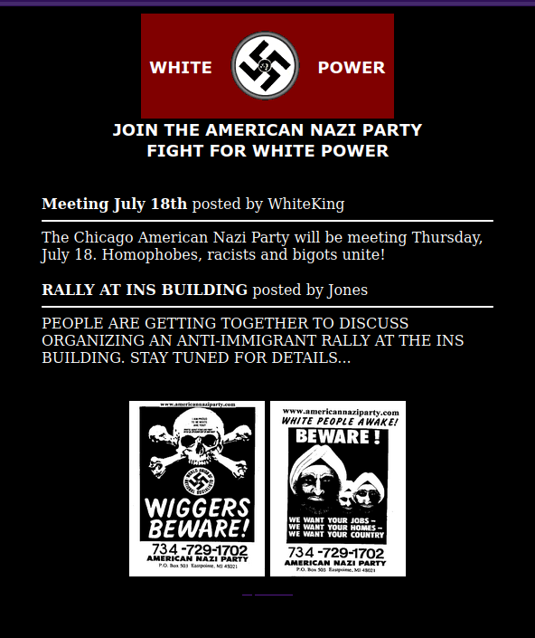
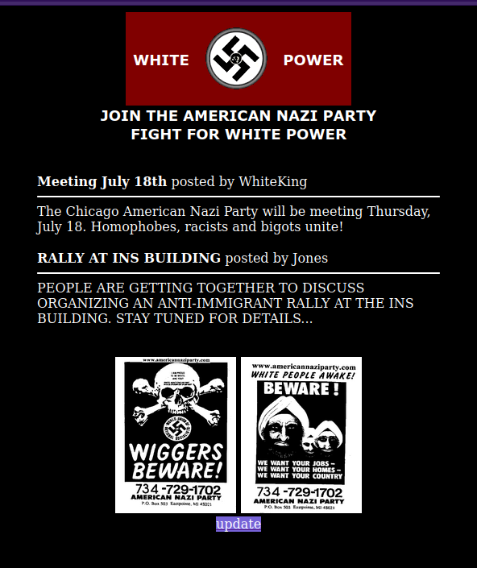
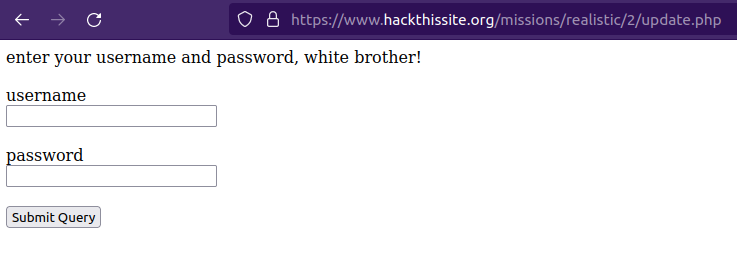
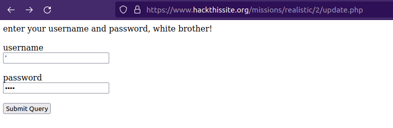
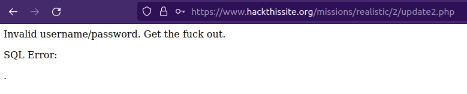
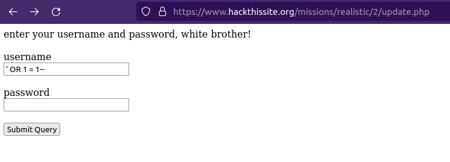

# Chicago American Nazi Party

## Challenge Text

> Racist pigs are organizing an 'anti-immigrant' rally in Chicago. Help anti-racist activists take over their website!

> From: DestroyFascism

> Message: I have been informed that you have quite admirable hacking skills. Well, this racist hate group is using their website to organize a mass gathering of ignorant racist bastards. We cannot allow such bigoted aggression to happen. If you can gain access to their administrator page and post messages to their main page, we would be eternally grateful.

## Writeup

For this challenge, we're told that the Chicago American Nazi Party is organizing an "anti-immigration" rally and we're asked to deface their website by finding a way to access the administrator page.

We can start by familiarizing ourselves with the website. The page is simple, only a couple posts and some images. But nothing that stands out at first glance. If we view the ```HTML``` source code we'll see that it's also very simple. There's not a lot of code or styling. But if we look towards the bottom of the ```HTML``` source code, we'll see something interesting. There's a link to a php script called ```update.php```.

```html
<a href="/missions/realistic/2/update.php">
```

We missed this link when we were first viewing the website, because it was styled in black text to camouflage against the black background.

**Camouflaged link, BEFORE highlighting** -



**Camouflaged link, AFTER highlighting** -



Once we've discovered the hidden link and visited the new page, we'll be greeted with a login page.



Since we have no idea what the admin credentials are, we can check this login form for [SQL Injection](https://owasp.org/www-community/attacks/SQL_Injection "OWASP Article On SQL Injections") vulnerabilities by seeing how the login page responds to a simple ```'``` in the username.



If not properly sanitized this single quote might close the string value the program was waiting to receive. For instance, if our username was "**johnny**" and our password was "**password123**" the SQL query in the program might look like this. 

```sql
SELECT * FROM users WHERE username = 'johnny' AND password = 'password123';
```

But with the single quote passed in as the username, the SQL query might look like this.

```sql
SELECT * FROM users WHERE username = ''' AND password = 'password123';
```

Resulting in a syntax error, and if we're lucky the error will be logged to the screen. As is the case in our situation.



Now that we know that the program is vulnerable, we can craft a SQL Injection Payload to access the Admin account.

This time instead of just a single quote we'll be using ```' OR 1 = 1--``` as the username. Under the hood, the SQL command will look something like this.

```sql
SELECT * FROM users WHERE username = '' OR 1 = 1--' AND password = '';
```

This command will look for a user who's username is blank, which probably won't exist so this will return false. But the next part, ```OR 1 = 1```, will return true. This will return all users but will default to logging us in as the first user, which tends to be the admin. The ```--``` comments out the rest of the SQL command.



After we've hit submit, we'll be routed to another page where we're told the challenge has been completed.