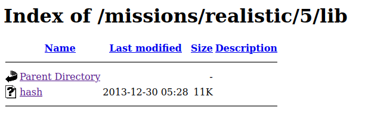
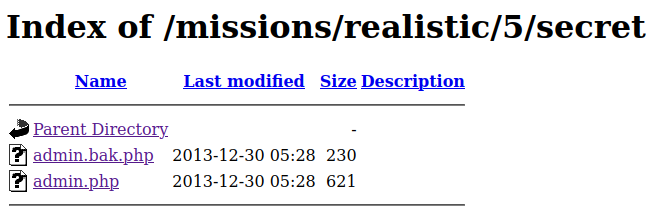

# Damn Telemarketers!

## Challenge Text

> Telemarketers are invading people's privacy and peace and quiet. Get the password for the administrative section of the site to delete their database and return the privacy of their victims!

> From: spiffomatic64

> Message: Yo! This is Spiffomatic64 from Hackthissite.org! I'm a bit of a hacker myself as you can see, but I recently came upon a problem I couldn't resolve.....
> Lately I've been getting calls day and night from the telemarketing place. I've gone to their [website](https://www.hackthissite.org/missions/realistic/5/ "Level 5 Website") and hacked it once deleting all of their phone numbers so they wouldn't call me anymore. That was a temporary fix but they put their database back up, this time with an encrypted password. When I hacked them I noticed everything they used was 10 years out of date and the new password seems to be a 'message digest'. I have done some research and I think it could be something like a so-called hash value. I think you could somehow reverse engineer it or brute force it. I also think it would be a good idea to look around the server for anything that may help you.

## Writeup

For this challenge we're asked to help another hacker uncover a database password from a website belonging to a telemarketing corporation. Although he tells us the password is hashed, he never tells us where it is on the website, so we'll have to start with some [passive reconnaissance](https://www.techtarget.com/whatis/definition/passive-reconnaissance "Tech Target Article On Passive Reconnaissance").

Visiting the website for [Compu-Global-Hyper-Mega-Net](https://www.hackthissite.org/missions/realistic/5/ "Level 5 Website") we'll find general contact information along with links to other pages on the website. These links include the [home](https://www.hackthissite.org/missions/realistic/5/main.htm "Level 5 Website Home Page"), [news](https://www.hackthissite.org/missions/realistic/5/news.htm "Level 5 Website News Page"), [database](https://www.hackthissite.org/missions/realistic/5/submit.html "Level 5 Website Database Page") and [contact](https://www.hackthissite.org/missions/realistic/5/contact.htm "Level 5 Website Contact Page") pages, but only two of these are beneficial to us, the [news](https://www.hackthissite.org/missions/realistic/5/news.htm "Level 5 Website News Page") and [database](https://www.hackthissite.org/missions/realistic/5/submit.html "Level 5 Website Database Page") pages.

The [database](https://www.hackthissite.org/missions/realistic/5/submit.html "Level 5 Website Database Page") page is where we can find the password protected database mentioned by the hacker, so we'll need to come back to this page later.

The [news](https://www.hackthissite.org/missions/realistic/5/news.htm "Level 5 Website News Page") page contains the following reverse chronological list of updates relating to the [Compu-Global-Hyper-Mega-Net](https://www.hackthissite.org/missions/realistic/5/ "Level 5 Website") website.

* 9/29/03 - The database is now available online again for administrators only! 

* 9/15/03 - Google was grabbing links it shouldn't be so I have taken extra precautions.

* 9/10/03 - New service purchased from castle to get past "zapp".

* 7/15/03 - Web site was hacked into and all database entries deleted.

* 6/28/03 - The database is now available online.

* 6/20/03 - Web site created and dedicated to my lovely girlfriend haley!

Out of these updates, one really stands out. The news that "extra precautions" have been taken to safeguard from Googles site crawlers.

```
9/15/03 - Google was grabbing links it shouldn't be so I have taken extra precautions.
```

This piece of information implies the existence of a [robots.txt](https://en.wikipedia.org/wiki/Robots.txt "Wikipedia Entry On Robots File") file which is being used to indicate to any web crawlers visiting the website what pages it can crawl and which it can't. Polite web crawlers will abide by the rules present in a ```robots.txt``` file but hackers and rogue crawlers tend to ignore these rules, or use this file as a guide for what pages they should visit first, which is exactly what we'll be doing.

Visiting https://www.hackthissite.org/missions/realistic/5/robots.txt we'll see two directories that the site administrator has asked crawlers **NOT** to visit, one named ```/lib``` and another named ```/secret```.

```
User-agent: *
Disallow: /lib
Disallow: /secret
```

If we visit https://www.hackthissite.org/missions/realistic/5/lib/ we'll see an unprotected directory that contains a mystery file named [hash](./hash "Hash File From lib Directory").




Downloading this file and running the [Linux file command](https://www.geeksforgeeks.org/file-command-in-linux-with-examples/ "Geeks For Geeks Article On Linux File Command") on the hash program we'll see that it's a 32-bit executable.

```
$ file hash

hash: ELF 32-bit LSB executable, Intel 80386, version 1 (FreeBSD), dynamically linked, interpreter /libexec/ld-elf.so.1, not stripped
```

Even though we can't run this file, we can use the [Linux strings command](https://www.howtoforge.com/linux-strings-command/ "How To Forge Article On Linux Strings Command") to get an idea of what this program _might_ be doing.

```
$ strings hash

<SOME OUPTUT REDACTED FOR BREVITY>

Error: MDupdate MD already done.
Error: MDupdate called with illegal count value %d.
MD4 time trial. Processing 1 million 64-character blocks...
 is digest of 64M byte test input.
Seconds to process test input:   %g
Characters processed per second: %ld.
ABCDEFGHIJKLMNOPQRSTUVWXYZabcdefghijklmnopqrstuvwxyz0123456789
B "%s"
%s can't be opened.
MD4 test suite results:
message digest
md4.c
MDblock
md4driver.c
```

Looking through the output from the ```strings``` command we can see a bunch of references to the [MD4 cryptographic hash function](https://en.wikipedia.org/wiki/MD4 "Wikipedia Entry For MD4").

Moving on to the other unprotected directory at https://www.hackthissite.org/missions/realistic/5/secret/ we'll see two files, one named [admin.bak.php](https://www.hackthissite.org/missions/realistic/5/secret/admin.bak.php "Admin Page Backup") and another named [admin.php](https://www.hackthissite.org/missions/realistic/5/secret/admin.php "Level 5 Admin Page").



The [admin.php](https://www.hackthissite.org/missions/realistic/5/secret/admin.php "Level 5 Admin Page") page is where the password supplied at the database page (https://www.hackthissite.org/missions/realistic/5/submit.html) is sent for verfification. This can also be seen by examining the HTML source code for the ```submit.html``` page, specifically the form area.

```html
Enter Password:
<form action="secret/admin.php">
<input type="password" name="password" size="20"><input type="submit" value="submit" name="submit">
</form>
```

The other page, [admin.bak.php](https://www.hackthissite.org/missions/realistic/5/secret/admin.bak.php "Admin Page Backup"), contains the following line.

```error matching hash 58c8033d567e767fc90577bbab82d1a5```

Here we can see information leakage from the backup admin page, and we find out the ```admin.php``` file checks wether the hash value of a password matches ```58c8033d567e767fc90577bbab82d1a5```.

Combining this newfound information with the MD4 references from earlier we can assume this is an MD4 hash, and may have been hashed with the [program we found in the lib directory](./hash "Hash File From lib Directory").

Now that we have a hashed password we can focus on cracking it with [John The Ripper](https://en.wikipedia.org/wiki/John_the_Ripper "Wikipedia Entry For John The Ripper") which can be downloaded at the [John The Ripper GitHub Repository](https://github.com/openwall/john "Jumbo John GitHub Repository").

The syntax for cracking an MD4 hash with ```John The Ripper``` is ```john --format=Raw-MD4 <File_Name>``` so we'll need to store the hash into it's own file, the output after running the command should look similar to the following.

```
$ john --format=Raw-MD4 hash.txt

Using default input encoding: UTF-8
Loaded 1 password hash (Raw-MD4 [MD4 256/256 AVX2 8x3])
Press 'q' or Ctrl-C to abort, almost any other key for status
Almost done: Processing the remaining buffered candidate passwords, if any.
Proceeding with wordlist:/usr/share/john/password.lst
Proceeding with incremental:ASCII
7d084            (?)     

Session completed.
```

We can see that John successfully cracked the hashed password, the password was ```7d084```, and after submiting that at the [database](https://www.hackthissite.org/missions/realistic/5/submit.html "Level 5 Website Database Page") we can complete the challenge.
