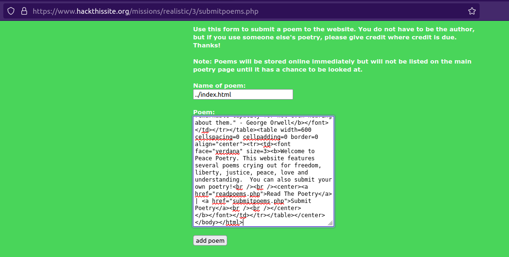

# Peace Poetry: HACKED

## Challenge Text

> A little girl made a website to post poetry related to peace and understanding. American fascists have hacked this website replacing it with Hitler-esque propaganda. Can you repair the website?

> From: PeacePoetry

> Message: I run this website where people can read and submit peace-related poetry. I am doing this out of good will towards others, and I don't see why I would be making enemies out of this, but some real ass hole hacked my website posting a bunch of ignorant aggressive propaganda on the front page. And I made that website a while ago, and I no longer have access to it. Do you think you can hack in and change it back? Please? Oh, and bonus points if you message me the name of the bastard who did this! My website can be found [here](https://www.hackthissite.org/missions/realistic/3/ "Level 3 Website").

## Writeup

For this challenge, we're told that a "peace-related poetry" website has been defaced by "fascist hackers", and the site owner has asked for our help in restoring the website.

If we visit the website for this challenge, we'll see the defacement mentioned earlier and at the bottom of the page we'll find a tagline from the hackers.

```
This page h4x0r3d by the Insane Krypt Skiddies. Shoutz to Ultra Death Laser, Master Of Disaster, and Doctor Doom.
```

Our next step is to check the ```HTML``` source code for any clues, where we'll find a comment from a very polite hacker. Apparently, the original webpage was not destroyed, it still exists on the server under the new name "```oldindex.html```". 

```html
<!--Note to the webmasterThis website has been hacked, but not totally destroyed. The old website is still up. I simply copied the old index.html file to oldindex.html and remade this one. Sorry about the inconvenience.-->
```

Once we navigate to the original website at https://www.hackthissite.org/missions/realistic/3/oldindex.html, we'll be greeted with a very simple webpage with two links. One to [read poetry](https://www.hackthissite.org/missions/realistic/3/readpoems.php "Read Poetry Webpage") and another to [submit poetry](https://www.hackthissite.org/missions/realistic/3/submitpoems.php "Submit Poetry Webpage").

The webpage for reading poems won't help us at all, and it leads nowhere so I won't spend much time talking about it except to say that one of the "poems" on the site (the one called hacker) is a famous piece of hacker history. Originally titled "_The Conscience of a Hacker_" or "[_The Hackers Manifesto_](https://en.wikipedia.org/wiki/Hacker_Manifesto "Wikipedia Entry For The Hackers Manifesto")", this text is an essay that was written by [Loyd Blankenship](https://en.wikipedia.org/wiki/Loyd_Blankenship "Wikipedia Entry For Loyd Blankenship") under the pseudonym "The Mentor", right after his arrest.

```
Hacker

Another one got caught today, it's all over the papers. "Teenager
Arrested in Computer Crime Scandal", "Hacker Arrested After Bank
Tampering"...Damn kids. They're all alike. But did you, in your
three-piece psychology and 1950's technobrain, ever take a look
behind the eyes of a Hacker? Did you ever wonder what made him tick,
what forces shaped him, what may have molded him?

I am a Hacker, enter my world... Mine is a world that begins with
School... I'm smarter than most of the other kids, this crap they
teach us bores me... Damn underachiever. They're all alike. I'm in
Junior High or High School. I've listened to Teachers explain for
the fifteenth time how to reduce a fraction. I understand it. "No
Ms. Smith, I didn't show my work, I did it in my head..." Damn kid,
probably copied it. They're all alike.

I made a discovery today. I found a computer. Wait a second, this is
cool. It does what I want it to. If it makes a mistake, it's because
I screwed up. Not because it doesn't like me...Or feels threatened
by me... Or thinks I'm a smart ass... Or doesn't like teaching and
shouldn't be here...

Damn kid. All he does is play games. They're all alike. And then it
happened... A door opened to a world... rushing through the phone
line like heroin through an addicts veins, an electronic pulse is
sent out, a refuge from the day-to-day incompetencies is sought... a
board is found. "This is it, this is where I belong..." I know
everyone here, even if I've never met them, never talked to them,
may never hear from them again... I know you all.

Damn kid, tying up the phone line again. They're all alike... You
bet your ass we're all alike...

We've been spoon-fed baby food at School when we hungered for
steak... the bits of meat that you did let slip through were
pre-chewed and tasteless. We've been dominated by sadists, or
ignored by the apathetic. The few that had something to teach found
us willing pupils, but those few are like drops of water in the
desert.

This is our world now, the world of the electron and the switch, the
beauty of the baud. We make use of a service already existing
without paying for what could be dirt-cheap if it wasn't run by
profiteering gluttons, and you call us Criminals. We seek after
knowledge, and you call us Criminals.

We exist without skin colour, without nationality, without religious
bias... and you call us Criminals. You build atomic bombs, you wage
wars, you murder, cheat and lie to us, and try and make us believe
it's for our own good, yet we're the Criminals.

Yes I am a Criminal, my crime is that of curiosity. My crime is that
of judging people by what they say and think, not what they look
like. My crime is that of outsmarting you, something that you will
never forgive me for.

I am a Hacker, this is my Manifesto. You may stop the individual,
but you can't stop us all. After all, we're all alike.

The Mentor
```

If we visit the [submit poetry](https://www.hackthissite.org/missions/realistic/3/submitpoems.php "Submit Poetry Webpage") page, we'll see a simple form with two inputs. One for the poems name and the other ```<input>``` for the poem itself. The only hint we get that this form contains a vulnerability is the line that says:

>Note: Poems will be stored online immediately but will not be listed on the main poetry page until it has a chance to be looked at.

The posts are being stored somewhere on the server until they can be looked at by the owner/administrator, they are being stored as individual files with the same name as the poem title.

To "fix" the defacement, we'll have to overwrite the ```index.html``` file with the ```oldindex.html``` source code. We can do this by pasting the HTML source code from ```oldindex.html``` into the poem section of the form and giving it the name ```../index.html```.

**```oldindex.html``` Source Code:**

```html
<!DOCTYPE HTML PUBLIC "-//W3C//DTD HTML 4.01 Transitional//EN"        "http://www.w3.org/TR/1999/REC-html401-19991224/loose.dtd"><html><head>	<title>peace be with all</title></head><body background="bg.jpg" text='#FFFFFF' link="#FFF833" vlink="#FFF833"><center><font face="verdana" size=7><b>Peace Poetry</b></font><table cellspacing=0 border=0 cellpadding=0 align="center" width=760><tr><td width=230><font face="verdana" size=2><b>"What difference does it make to the dead, the orphans and the homeless, whether the mad destruction is wrought under the name of totalitarianism or the holy name of liberty and democracy?" - Mahatma Gandi<br /><br />"A war is not won if the defeated enemy has not been turned into a friend."</b></font></td><td width=300 valign="top"></td><td width=230><font face="verdana" size=2><b>"The greatest purveyor of violence in the world today is my own government. For the sake of hundreds of thousands trembling under our violence, I cannot be silent." - Martin Luther King Jr.<br /><br />"The nationalist not only does not disapprove of atrocities committed by his own side, but he has a remarkable capacity for not even hearing about them." - George Orwell</b></font></td></tr></table><table width=600 cellspacing=0 cellpadding=0 border=0 align="center"><tr><td><font face="verdana" size=3><b>Welcome to Peace Poetry. This website features several poems crying out for freedom, liberty, justice, peace, love and understanding.  You can also submit your own poetry!<br /><br /><center><a href="readpoems.php">Read The Poetry</a> | <a href="submitpoems.php">Submit Poetry</a><br /><br /></center></b></font></td></tr></table></center></body></html>
```


