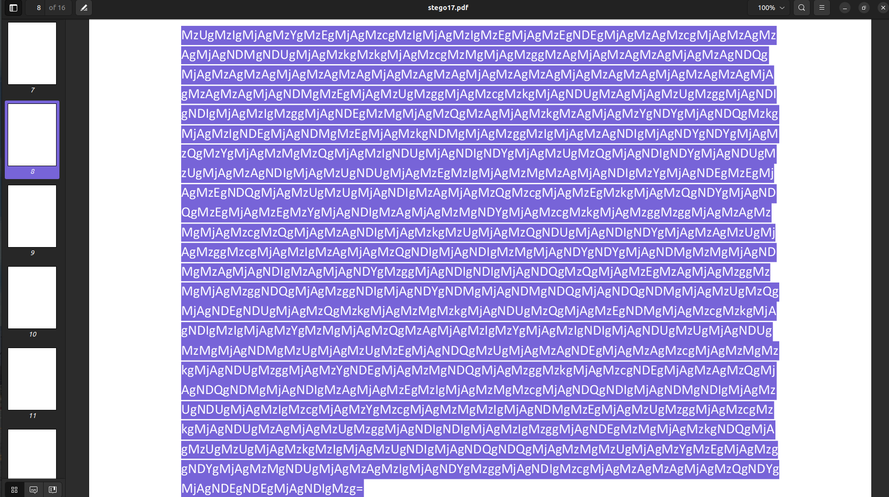

# Level 17

## Challenge Text

> None

## Writeup

**This Level Is Unifinished, These Are My Notes So Far -**

For this challenge we're given no hint, just the following image.


Using [exiftool](https://en.wikipedia.org/wiki/ExifTool "Wikipedia Entry For Exiftool") to extract metadata reveals nothing interesting.

Using the [Linux strings command](https://w3cschoool.com/tutorial/linux-strings-command "Article On Linux Strings Command"), we can see mentions of Adobe ImageReady and a RAR file that contains a PDF named [stego17.pdf](./stego17.pdf "Stego 17 PDF That Was Hidden In JPEG")

```
$ strings stego17.jpg

JFIF
4Exif
Adobe ImageReady
 $.' ",#
(7),01444
'9=82<.342
!22222222222222222222222222222222222222222222222222
$3br
%&'()*456789:CDEFGHIJSTUVWXYZcdefghijstuvwxyz
	#3R
&'()*56789:CDEFGHIJSTUVWXYZcdefghijstuvwxyz
geEa
`xf@
UI$k*
F]c'*
h[]Aw
QEfPQE
wKk+
mW;O8
FeD.
tKcqs%
K4?<
}k7K
~iy|
*)f!T
S;nb
Cqr.]
QE6I
!8i~y
E4^sF
Rar!
stego17.pdf
```

**Using GREP to find the RAR File In Hex Dump -**

```
$ xxd stego17.jpg | grep Rar

000008e0: d952 6172 211a 0700 cf90 7300 000d 0000  .Rar!.....s.....
```

**RAR With stego17.pdf Can Be Seen In Hexdump -**

```
000008e0: d952 6172 211a 0700 cf90 7300 000d 0000  .Rar!.....s.....
000008f0: 0000 0000 00dd ec74 2080 2b00 7664 0000  .......t .+.vd..
00000900: ed93 0000 02d3 0a7d 2880 aa61 3a1d 350b  .......}(..a:.5.
00000910: 0020 0000 0073 7465 676f 3137 2e70 6466  . ...stego17.pdf
```

Using [binwalk](https://www.kali.org/tools/binwalk/ "Kali Linux Docs For Binwalk") with the command ```binwalk -e <File Name>```, we can extract the RAR file.

```
$ binwalk -e stego17.jpg

DECIMAL       HEXADECIMAL     DESCRIPTION
--------------------------------------------------------------------------------
0             0x0             JPEG image data, JFIF standard 1.01
30            0x1E            TIFF image data, little-endian offset of first image directory: 8
2273          0x8E1           RAR archive data, version 4.x, first volume type: MAIN_HEAD
```

Once we've extracted the PDF named [stego17.pdf](./stego17.pdf "Stego 17 PDF That Was Hidden In JPEG") we can extract the metadata with [exiftool](https://en.wikipedia.org/wiki/ExifTool "Wikipedia Entry For Exiftool"), and this time we'll find a creator/author name. This file was made by someone named ```Andrew08```.

```
$ exiftool stego17.pdf

ExifTool Version Number         : 12.40
File Name                       : stego17.pdf
Directory                       : .
File Size                       : 37 KiB
File Modification Date/Time     : 2009:03:01 21:20:00-07:00
File Permissions                : -rw-rw-r--
File Type                       : PDF
File Type Extension             : pdf
MIME Type                       : application/pdf
PDF Version                     : 1.4
Linearized                      : Yes
Tagged PDF                      : Yes
XMP Toolkit                     : Adobe XMP Core 4.0-c316 44.253921, Sun Oct 01 2006 17:14:39
Producer                        : Acrobat Distiller 8.1.0 (Windows)
Source Modified                 : D:20090301141939
Creator Tool                    : Acrobat PDFMaker 8.1 for Word
Modify Date                     : 2009:03:01 21:19:59+07:00
Create Date                     : 2009:03:01 21:19:53+07:00
Metadata Date                   : 2009:03:01 21:19:59+07:00
Subject                         : 2
Format                          : application/pdf
Creator                         : Andrew08
Title                           : 
Page Count                      : 16
Page Layout                     : OneColumn
Language                        : EN-US
Author                          : Andrew08
```

Viewing the [stego17.pdf](./stego17.pdf "Stego 17 PDF That Was Hidden In JPEG") in a regular text editor and using ```CTRL + f``` to search for the string ```/Type/Page``` to find all pages in the PDF we'll see that page 8 is packed with information that doesn't exist on the other pages.

Highlighting everything on page 8, we'll find white text was camouflaging against the white background.



The text reads...

```
MzUgMzIgMjAgMzYgMzEgMjAgMzcgMzIgMjAgMzIgMzEgMjAgMzEgNDEgMjAgMzAgMzcgMjAgMzAgMz
AgMjAgNDMgNDUgMjAgMzkgMzkgMjAgMzcgMzMgMjAgMzggMzAgMjAgMzAgMzAgMjAgMzAgNDQg
MjAgMzAgMzAgMjAgMzAgMzAgMjAgMzAgMzAgMjAgMzAgMzAgMjAgMzAgMzAgMjAgMzAgMzAgMjA
gMzAgMzAgMjAgNDMgMzEgMjAgMzUgMzggMjAgMzcgMzkgMjAgNDUgMzAgMjAgMzUgMzggMjAgNDI
gNDIgMjAgMzIgMzggMjAgNDEgMzMgMjAgMzQgMzAgMjAgMzkgMzAgMjAgMzYgNDYgMjAgNDQgMzkg
MjAgMzIgNDEgMjAgNDMgMzEgMjAgMzkgNDMgMjAgMzggMzIgMjAgMzAgNDIgMjAgNDYgNDYgMjAgM
zQgMzYgMjAgMzMgMzQgMjAgMzIgNDUgMjAgNDIgNDYgMjAgMzUgMzQgMjAgNDIgNDYgMjAgNDUgM
zUgMjAgMzAgNDIgMjAgMzUgNDUgMjAgMzEgMzIgMjAgMzMgMzAgMjAgNDIgMzYgMjAgNDEgMzEgMj
AgMzEgNDQgMjAgMzUgMzUgMjAgNDIgMzAgMjAgMzQgMzcgMjAgMzEgMzkgMjAgMzQgNDYgMjAgND
QgMzEgMjAgMzEgMzYgMjAgNDIgMzAgMjAgMzMgNDYgMjAgMzcgMzkgMjAgMzggMzggMjAgMzAgMz
MgMjAgMzcgMzQgMjAgMzAgNDIgMjAgMzkgMzUgMjAgMzQgNDUgMjAgNDIgNDYgMjAgMzAgMzUgMj
AgMzggMzcgMjAgMzIgMzAgMjAgMzQgNDIgMjAgNDIgMzMgMjAgNDYgNDYgMjAgNDMgMzMgMjAgND
MgMzAgMjAgNDIgMzAgMjAgNDYgMzggMjAgNDIgNDIgMjAgNDQgMzQgMjAgMzEgMzAgMjAgMzggMz
MgMjAgMzggNDQgMjAgMzggNDIgMjAgNDYgNDMgMjAgNDMgNDQgMjAgNDQgNDMgMjAgMzUgMzQg
MjAgNDEgNDUgMjAgMzQgMzkgMjAgMzMgMzkgMjAgNDUgMzQgMjAgMzEgNDMgMjAgMzcgMzkgMjA
gNDIgMzIgMjAgMzYgMzMgMjAgMzQgMzAgMjAgMzIgMzYgMjAgMzIgNDIgMjAgNDUgMzUgMjAgNDUg
MzMgMjAgNDMgMzUgMjAgMzUgMzEgMjAgNDQgMzUgMjAgMzAgNDEgMjAgMzAgMzcgMjAgMzMgMz
kgMjAgNDUgMzggMjAgMzYgNDEgMjAgMzMgNDQgMjAgMzggMzkgMjAgMzcgNDEgMjAgMzAgMzQgMj
AgNDQgNDMgMjAgNDIgMzAgMjAgMzEgMzIgMjAgMzMgMzcgMjAgNDQgNDIgMjAgNDMgNDIgMjAgMz
UgNDUgMjAgMzIgMzcgMjAgMzYgMzcgMjAgMzMgMzIgMjAgNDMgMzEgMjAgMzUgMzggMjAgMzcgMz
kgMjAgNDUgMzAgMjAgMzUgMzggMjAgNDIgNDIgMjAgMzIgMzggMjAgNDEgMzMgMjAgMzkgNDQgMjA
gMzUgMzUgMjAgMzkgMzIgMjAgMzUgNDIgMjAgNDQgNDQgMjAgMzMgMzUgMjAgMzYgMzEgMjAgMzg
gNDYgMjAgMzMgNDUgMjAgMzAgMzIgMjAgNDYgMzggMjAgNDIgMzcgMjAgMzAgMzAgMjAgMzQgNDYg
MjAgNDEgNDEgMjAgNDIgMzg=
```

Looking at the "```=```" sign at the end we can tell this is a [base64](https://en.wikipedia.org/wiki/Base64 "Wikipedia Entry For Base64") encoded string, decoding it reveals the following hex codes.


```
35 32 20 36 31 20 37 32 20 32 31 20 31 41 20 30 37 20 30 30 20 43 45 20 39 39 20 37 33 20 38 30 20 30 30 20 30 44 20 30 30 20 30 30 20 30 30 20 30 30 20 30 30 20 30 30 20 30 30 20 43 31 20 35 38 20 37 39 20 45 30 20 35 38 20 42 42 20 32 38 20 41 33 20 34 30 20 39 30 20 36 46 20 44 39 20 32 41 20 43 31 20 39 43 20 38 32 20 30 42 20 46 46 20 34 36 20 33 34 20 32 45 20 42 46 20 35 34 20 42 46 20 45 35 20 30 42 20 35 45 20 31 32 20 33 30 20 42 36 20 41 31 20 31 44 20 35 35 20 42 30 20 34 37 20 31 39 20 34 46 20 44 31 20 31 36 20 42 30 20 33 46 20 37 39 20 38 38 20 30 33 20 37 34 20 30 42 20 39 35 20 34 45 20 42 46 20 30 35 20 38 37 20 32 30 20 34 42 20 42 33 20 46 46 20 43 33 20 43 30 20 42 30 20 46 38 20 42 42 20 44 34 20 31 30 20 38 33 20 38 44 20 38 42 20 46 43 20 43 44 20 44 43 20 35 34 20 41 45 20 34 39 20 33 39 20 45 34 20 31 43 20 37 39 20 42 32 20 36 33 20 34 30 20 32 36 20 32 42 20 45 35 20 45 33 20 43 35 20 35 31 20 44 35 20 30 41 20 30 37 20 33 39 20 45 38 20 36 41 20 33 44 20 38 39 20 37 41 20 30 34 20 44 43 20 42 30 20 31 32 20 33 37 20 44 42 20 43 42 20 35 45 20 32 37 20 36 37 20 33 32 20 43 31 20 35 38 20 37 39 20 45 30 20 35 38 20 42 42 20 32 38 20 41 33 20 39 44 20 35 35 20 39 32 20 35 42 20 44 44 20 33 35 20 36 31 20 38 46 20 33 45 20 30 32 20 46 38 20 42 37 20 30 30 20 34 46 20 41 41 20 42 38
```

Converting these from Hex we'll get Hex Codes **again**.

```
52 61 72 21 1A 07 00 CE 99 73 80 00 0D 00 00 00 00 00 00 00 C1 58 79 E0 58 BB 28 A3 40 90 6F D9 2A C1 9C 82 0B FF 46 34 2E BF 54 BF E5 0B 5E 12 30 B6 A1 1D 55 B0 47 19 4F D1 16 B0 3F 79 88 03 74 0B 95 4E BF 05 87 20 4B B3 FF C3 C0 B0 F8 BB D4 10 83 8D 8B FC CD DC 54 AE 49 39 E4 1C 79 B2 63 40 26 2B E5 E3 C5 51 D5 0A 07 39 E8 6A 3D 89 7A 04 DC B0 12 37 DB CB 5E 27 67 32 C1 58 79 E0 58 BB 28 A3 9D 55 92 5B DD 35 61 8F 3E 02 F8 B7 00 4F AA B8
```

Converting these from Hex to ASCII we'll see another RAR file.

```
Rar!...Î.s..
.......ÁXyàX»(£@.oÙ*Á...ÿF4.¿T¿å.^.0¶¡.U°G.OÑ.°?y..t..N¿.. K³ÿÃÀ°ø»Ô....üÍÜT®I9ä.y²c@&+åãÅQÕ
.9èj=.z.Ü°.7ÛË^'g2ÁXyàX»(£.U.[Ý5a.>.ø·.Oª¸
```

Taking the previous hex codes before we converted to ASCII and converting them to a RAR file we'll get the following password encrypted file.

[uncovered.rar](./uncovered.rar "uncovered.rar File")

**THIS IS WHERE I STOPPED MAKING PROGRESS**

I noticed that page 1 and page 16 have different content than the other pages, but I haven't made any progress in figuring out wether this is a rabbit hole or not.

I found some interesting articles that helped quite a bit so far, I'll link them below.

**Detailed Article On PDF Contents Under The Hood -**

http://preserve.mactech.com/articles/mactech/Vol.15/15.09/PDFIntro/index.html


**Helpful StackOverflow Q And A For PDF Steganography -**

https://stackoverflow.com/questions/27075859/steganography-hiding-data-in-pdf-files
