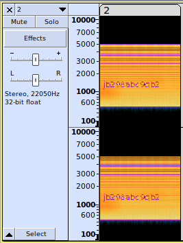

# Level 2

## Challenge Text

> did I hear that correctly?

## Writeup

For this challenge, the only hint we're given comes in the form of a question. We're asked "did I hear that correctly?", so it's probably safe to assume that this challenge involves [audio steganography](https://www.tutorialspoint.com/what-is-audio-steganography "Tutorials Point Article On Audio Steganography").

No file was given to us this level, so we'll start by inspecting the HTML source code for this page, obviously something is missing. If we look at the code around the password submit button we'll find an ```<embed>``` tag that never loaded in.

```html
<embed src="/missions/stego/lvl/2.wav">
```

This embed links to a ```wav``` audio file. We can download this file by visiting the following URL.

https://www.hackthissite.org/missions/stego/lvl/2.wav

Now that we have the audio file we can inspect it in a audio analysis tool like [Audacity](https://www.audacityteam.org/ "Audacity Website").

Once you've downloaded audacity and loaded the file in, you should see the waveform for the audio.


There are many ways to hide data in audio, but for this challenge we only need to know one. Using [spectograms](https://en.wikipedia.org/wiki/Spectrogram "Wikipedia Article On Viewing Spectogram"). Put simply, spectograms are visual representations of audio.

Most audio analysis tools come with a way to [view spectograms](https://manual.audacityteam.org/man/spectrogram_view.html "Audacity Article On How To View Spectograms"). If we view a spectogram of this audio we'll see the following.


Looking closely, you'll see obvious letters, but they're obscured. This audio file has an embedded image of some unclear text.

If we shrink the spectogram down a little bit, the letters become clearer.



Now the hidden message (level password) becomes clear, it reads the following.

```jb298abc9qb2```
