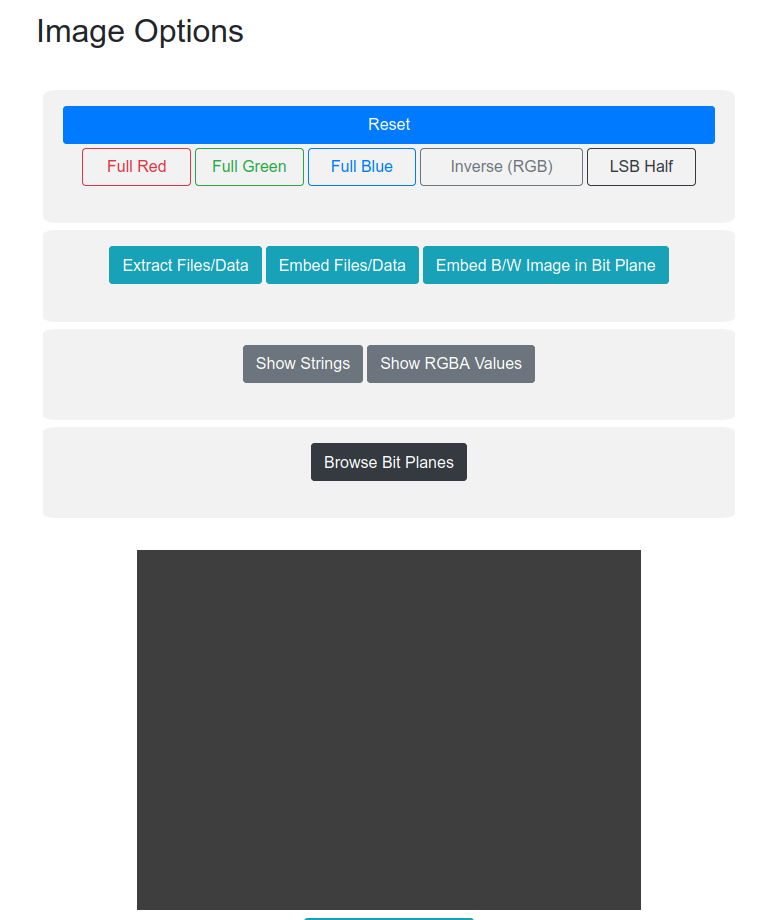

# Level 3

## Challenge Text

> Look carefully: it's obvious, just not at first sight.

## Writeup

For this challenge, the only hint we're given is to "look carefully", and given this image.


Viewing the metadata leads nowhere, neither does viewing the strings in the file. There's no files hidden inside that can be extracted. The hint we're given is really good though. It tells us to look carefully, so the hidden data is there and we're looking at it. We just need a way of viewing this differently.

The hint is really suggesting that this challenge involves [bit plane steganography](https://www.youtube.com/watch?v=KBfYpvN2aJQ "Crytography For Everybody YoutTube Video About Bit Plane Stego"). We can view all 32 bit planes of this image by using online tools like [StegOnline](https://stegonline.georgeom.net/image "Image Steganography Tool From George O").

Navigating to the [StegOnline](https://stegonline.georgeom.net/image "Image Steganography Tool From George O") webpage we should see an area to drag our image.


After we've uploaded our image, a list of options will appear.



Click on the ```Browse Bit Planes``` option to cycle through the red, green, blue, and alpha bit planes. Eventually you'll see two bit planes where a message becomes clearly visible.

* **Red 0 Bit Plane -**


* **Red 1 Bit Plane -**


Looking at the two new images, we can make out the following password...

```n38f298hsjf```
