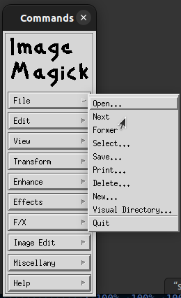
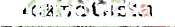

# Level 7

## Challenge Text

> None

## Writeup

For this challenge we're not given a hint, just a link to a zip file.

This is the first time we're getting an image from a zip and not a URL, so already this file is different than the others we've encountered so far.

Once we unzip this file we'll get an image named [stego7.tif](./stego7.tif "Level 7 Tiff Image"), tif files are high quality graphic files that use lossless compression and are mainly used in graphic design. You can read an [article on Tiff images](https://www.lifewire.com/tif-tiff-file-2622393 "Life Wire Article On Tiff Images") here if you'd like to learn more.

Our first step in looking for the hidden message in this file will be to view the image metadata with [exiftool](https://en.wikipedia.org/wiki/ExifTool "Wikipedia Entry On ").

Command Syntax - ```exiftool <file name>```

The output of the ```exiftool``` is really long for this image so I clipped the most relevant parts. We can see that this image was created in Adobe Photoshop, our first red flag. We can also see that this image is comprised of three layers, our second red flag.

```
Software                        : Adobe Photoshop CS2 Windows
Creator Tool                    : Adobe Photoshop CS2 Windows
Writer Name                     : Adobe Photoshop
Reader Name                     : Adobe Photoshop CS2
Layer Opacities                 : 100%, 100%, 100%
Layer Names                     : Layer 2, Layer 0, Layer 1
Layer Unicode Names             : Layer 2, Layer 0, Layer 1
```

Tif images can be comprised of many layers that can be stacked on top of each other, but in order to view them we'll need the proper software application. You can use [Adobe Photoshop](https://www.adobe.com/products/photoshop.html "Adobe PhotoShop Website"), if you have access to that. If you don't have PhotoShop, you can download [GIMP](https://www.gimp.org/ "GNU Image Manipulation Program"), which is a free and open source alternative. We can also use [Image Magick](https://imagemagick.org/ "Image Magick") for this challenge.

If using the Image Magick program, you can find the option to cycle through the layers under the ```File``` dropdown menu. Just click the ```Next``` button.



After cycling through the three different layers we'll see one layer clearly shows the hidden password, [layer 0](./stego7-layer-0.tif "Layer 0 Tif File").

Another way to extract all three layers, is to put the [stego7.tif](./stego7.tif "Level 7 Tiff Image") into a [Tiff To PNG Converter](https://www.freeconvert.com/tif-to-png "Free Convert's TIF To PNG Converter"). The converter will return four pngs.

**The Main TIF Image Converted To PNG -**


**TIF Image Layer 0 Converted To PNG -**



**TIF Image Layer 1 Converted To PNG -**


**TIF Image Layer 2 Converted To PNG -**


Looking closely at Layer 0, well see the following password.

```4aH5CEta```
