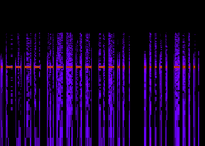
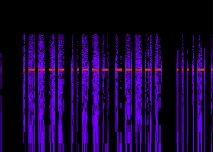
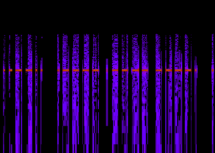
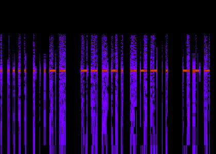
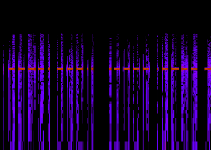
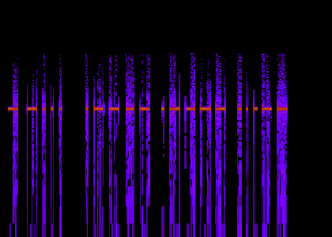

# Level 9

## Challenge Text

> kiss me alone

## Writeup

For this challenge, the only text we're given is "kiss me alone", and even after completing this challenge I have no idea how it's supposed to help.

We're also given a link to a zip file named [Stego9.zip](./Stego9.zip "Stego 9 ZIP File") which contains a wav file named [ecstasy-atb-music.wav](./ecstasy-atb-music.wav "Ecstasy ATB WAV File"). Listening to this song doesn't reveal any hidden information, it's just a 40 second clip from a song named "[You Are My Ecstasy](https://www.youtube.com/watch?v=lz6U5fPKb98 "You Are My Ecstasy On YouTube")" by ATB.

Using ```exiftool``` to extract metadata leads nowhere, and so does viewing a hexdump of the file. There are no hidden strings we can view by using the ```strings``` command, so our next step is to view a A [spectogram](https://en.wikipedia.org/wiki/Spectrogram "Wikipedia Entry On Spectograms") of the file.

A [spectogram](https://en.wikipedia.org/wiki/Spectrogram "Wikipedia Entry On Spectograms") is a visual representation of audio. We can view spectograms using audio analysis tools like [Audacity](https://www.audacityteam.org/ "Audacity Website"), if you don't have access to Audacity you can also use browser based tools like [Academo's Spectrum Analyzer](https://academo.org/demos/spectrum-analyzer/ "Academo's Spectrum Analyzer") or [DCODE's Spectral Analysis Tool](https://www.dcode.fr/spectral-analysis "DCODE's Spectral Analysis Tool").

Once you view the spectogram, you'll notice some really strange markings.



These markings alternate between two distinct types, short or long. The bars are either razor thin or a bit thick. Better yet, these bars and markings look like dots and dashes.

By now, you should probably realize these markings are really [morse code](https://en.wikipedia.org/wiki/Morse_code "Wikipedia Entry On Morse Code"). We can translate the morse code using online tools like [Cyber Chef](https://cyberchef.org/ "Cyber Chef Tool") or we can convert the morse by hand with the tables I provided below.

| **LETTER** | **MORSE CODE** |
|:----------:|:--------------:|
| A          | .-             |
| B          | -...           |
| C          | -.-.           |
| D          | -..            |
| E          | .              |
| F          | ..-.           |
| G          | --.            |
| H          | ....           |
| I          | ..             |
| J          | .---           |
| K          | -.-            |
| L          | .-..           |
| M          | --             |
| N          | -.             |
| O          | ---            |
| P          | .--.           |
| Q          | --.-           |
| R          | .-.            |
| S          | ...            |
| T          | -              |
| U          | ..-            |
| V          | ...-           |
| W          | .--            |
| X          | -..-           |
| Y          | -.--           |
| Z          | --..           |


| **NUMBER** | **MORSE CODE** |
|:----------:|:--------------:|
| 0          | -----          |
| 1          | .----          |
| 2          | ..---          |
| 3          | ...--          |
| 4          | ....-          |
| 5          | .....          |
| 6          | -....          |
| 7          | --...          |
| 8          | ---..          |
| 9          | ----.          |

| **PUNCTUATION** | **MORSE CODE** |
|:---------------:|:--------------:|
| .               | .-.-.-         |
| ;               | -.-.-.         |
| /               | -..-.          |
| '               | .----.         |
| -               | -....-         |
| :               | ---...         |
| ,               | --..--         |
| ?               | ..--..         |

Something else you may notice is that all the morse code found in the spectograms is grouped into sections of five, so we won't need the alphabet or punctuation tables above. These are all numbers.

| **NUMBER** | **MORSE CODE** |
|:----------:|:--------------:|
| 0          | -----          |
| 1          | .----          |
| 2          | ..---          |
| 3          | ...--          |
| 4          | ....-          |
| 5          | .....          |
| 6          | -....          |
| 7          | --...          |
| 8          | ---..          |
| 9          | ----.          |

Looking at the each part of the spectogram we'll see the following morse code.


**Morse -** ```.---- ----- --... ..... -....```



**Morse -** ```.---- ..--- ----- ....-```



**Morse -** ```---.. .---- .---- ----.```



**Morse -** ```..... ...-- ----. ---..```



**Morse -** ```----. ---.. .---- .----```



**Morse -** ```--... .---- .---- ...--```

Putting it all together we get the following morse code.

```
.---- ----- --... ..... -.... .---- ..--- ----- ....- ---.. .---- .---- ----. ..... ...-- ----. ---.. ----. ---.. .---- .---- --... .---- .---- ...--
```

After conversion we'll get this series of numbers ```1075612048119539898117113```, but if we submit these numbers as the password for this level we'll fail the challenge. Apparently, we have one more step to go.

Since we have a series of decimal numbers we can try converting them to [ASCII](https://en.wikipedia.org/wiki/ASCII "Wikipedia Entry For ASCII") but we'll need to break this series down into logical groups.

Assuming we're only using the ASCII range ```33-126``` we'll get the following numbers.

```107 56 120 48 119 53 98 98 117 113```

Converting those to decimal values to ASCII we'll finally get the following password.

```k8x0w5bbuq```
