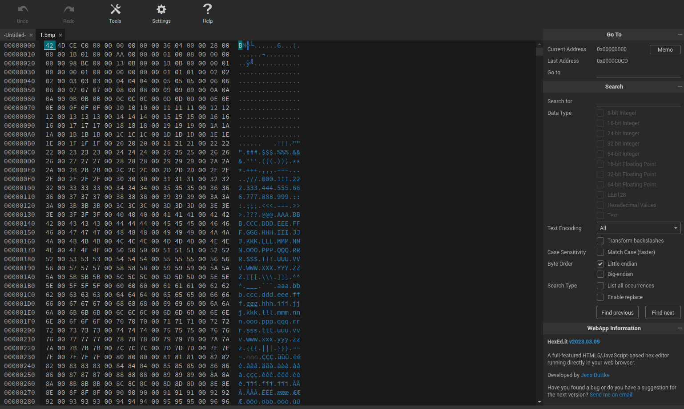
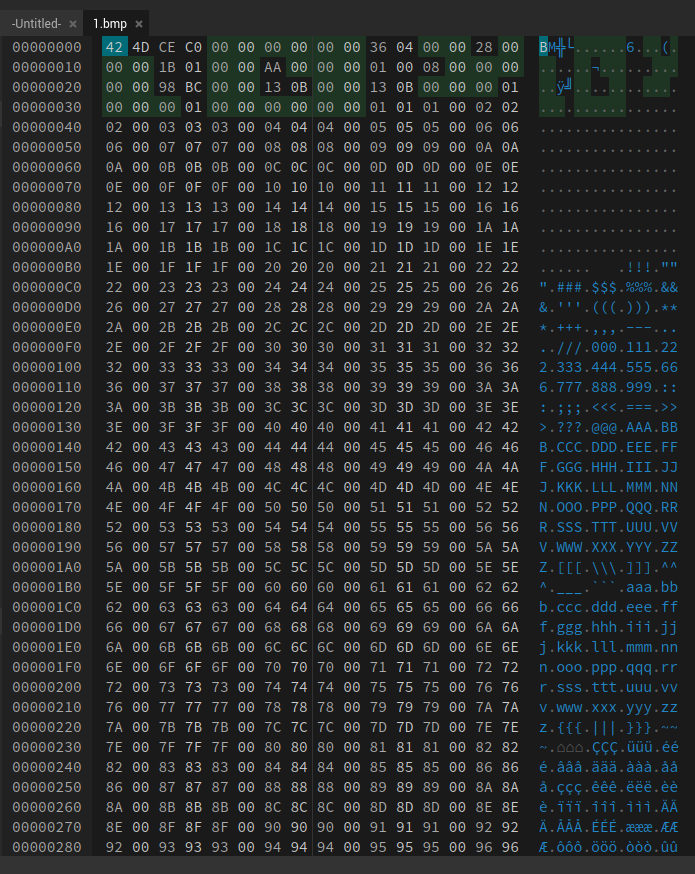
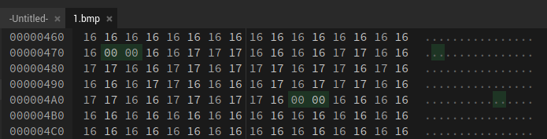

# Level 1

# Challenge Text

> This is an encoded message, the only tip you get is '2 null bytes'

> Thank (or blame :P) tiksi for making this challenge

> NOTE: There is no encoding error, stop submitting bug reports about it.

## Writeup


For this challenge we're given [an image](./1.bmp "Level 1 Image") with a message hidden inside. The only hint we're given is "2 null bytes". It's safe to assume with this hint that within the image are two null bytes that are being used as a marker or a delimiter. This is a way for the recipient of the hidden message to find it by simply looking for the agreed upon marker.

In order to look for the two null bytes we'll need a program to view a [hexdump](https://en.wikipedia.org/wiki/Hex_dump "Wikipedia Entry For HExdump") of the image. In linux you can use the [xxd](https://www.howtoforge.com/linux-xxd-command/ "How To Forge Article On Linux XXD Command") command, if you don't have Linux you can use a browser based hex editor like [hexed.it](https://hexed.it/ "Online Hex Editor"), for this example I'll be using the online hex editor.

After opening the file in a hex editor, we should see the following output.



To the right of the hex editor we'll find a search function. We'll use this to search for ```00 00```, our two hex bytes. Next we'll click the option ```List all occurences```.


Once we've clicked on the search button with our new options set, we'll see a bunch of matches around the header of the hexdump. Ignore these.



Moving past the null bytes around the header area, we'll only find two other null bytes in the whole hexdump and they're right near each other. This should set off a red flag. It seems that they may be markers, and the data between them may be our message.



If we take the hex values between the two null bytes we found, we'll see only a series of 16's and 17's.

```
16 16 17 17 17 16 16 16 16 17
17 16 16 17 17 16 16 17 17 16 17 17
17 16 17 17 16 17 16 16 16 16 17 17
16 16 16 16 17 16 17 17 17 16 16 17
17 16 16 17 17 16 17 17 16

```

Assuming this challenge involves [least significant bit](https://www.computerhope.com/jargon/l/leastsb.htm "Computer Hope Article On Least Significant Bit") steganography, we should extract the right most bit from each byte, and group them together. Later, we can convert these values to [ASCII](https://en.wikipedia.org/wiki/ASCII "Wikipedia Article On ASCII").

We'll start by converting the hexadecimal values 16 and 17 to binary with this [hex to binary converter](https://www.rapidtables.com/convert/number/hex-to-binary.html "Hex To Binary Converter") and taking the right most bit.

| **HEX** | **BINARY** | **LSB** |
|:-------:|:----------:|:-------:|
| 16      | 00010110   | 0       |
| 17      | 00010111   | 1       |

Now that we know 16's represent 0's and 17's represent 1's, we can replace every 16 and 17. That leaves us with the following.

```0011100001100110011011101101000011000010111001100110110```

If we break this collection of bits into bytes (groups of 8) we'll notice we're missing a bit.

* 00111000
* 01100110
* 01101110
* 11010000
* 11000010
* 11100110
* **0110110 <-- Missing Bit**

If we try to pad the end with an extra 0, we're left with the following.

```00111000 01100110 01101110 11010000 11000010 11100110 01101100```

The problem with this is that if we try to convert this to text with a [binary to text converter](https://www.rapidtables.com/convert/number/binary-to-ascii.html "Binary To Text Converter") we'll receive the following output.

```8fn���l```

This output can't possibly be our password, and this is honestly where I got stuck. After looking up help for this problem I found a video by a guy named Chuck Moore who covered the [solution for this challenge on YouTube](https://www.youtube.com/watch?v=fK3pmCKEB5I "Chuck Moores Walkthrough For This Challenge").

Apparently the missing bit is added to the second byte. Something that had to be found out through trial and error of appending the missing bit to different bytes at the start and end, a 0 or 1, and testing the output of the binary converted to text. Finally hitting on adding a 0 at the start of the second byte.

* 00111000
* **01100110 <-- Missing Bit**
* 01101110
* 11010000
* 11000010
* 11100110
* 0110110

So, we'll add the 0 bit to the start of the second byte and shift over the last bit of every bite until we have the correct bytes.

**Correct Byte Order -**

* 00111000
* 00110011
* 00110111
* 01101000
* 01100001
* 01110011
* 00110110

```00111000 00110011 00110111 01101000 01100001 01110011 00110110```

Now, we can convert to text with the [binary to text converter](https://www.rapidtables.com/convert/number/binary-to-ascii.html "Binary To Text Converter") we used earlier. The output will be the following.

```837has6```

Once we provide ```837has6``` as the password for level 1, the challenge will be completed succesfully.
